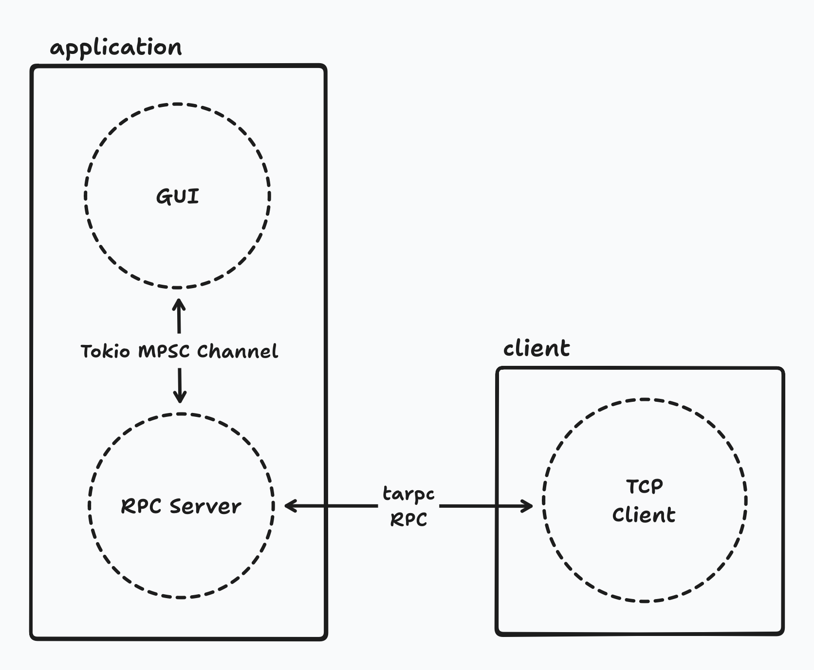
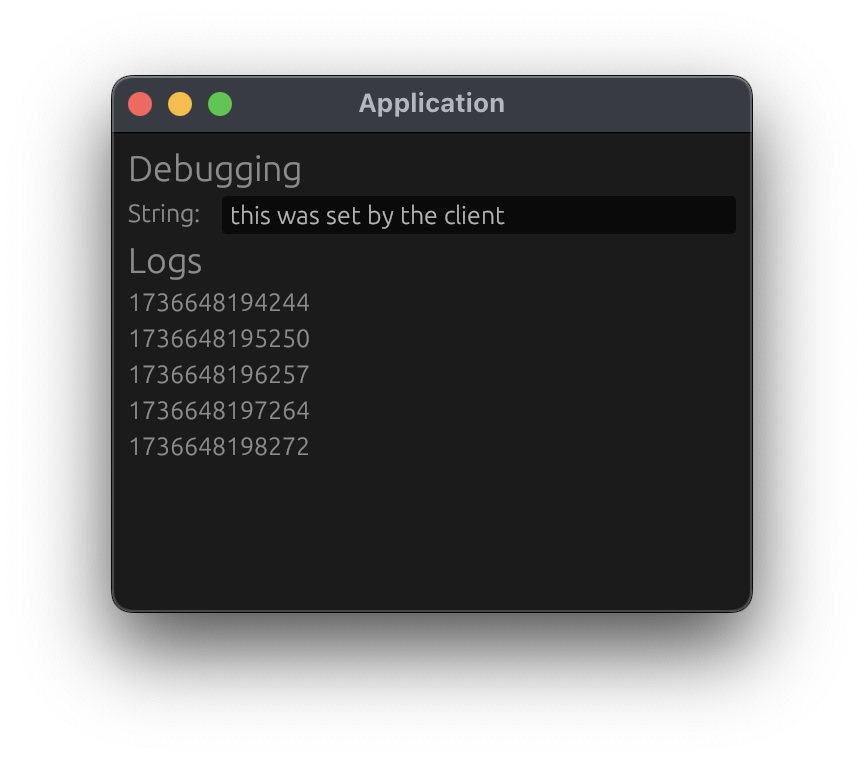

# rust_egui_tarpc_example

Basic example of building an [egui](http://egui.rs) application that can receive messages (RPCs) over TCP from a client in another process and update itself as a result.
This was built as a proof-of-concept for another application I was building and I'm sharing it in case it's helpful for someone.

At a high level,

- The GUI is written with [egui](http://egui.rs)
- The main program and the GUI communicate over a [tokio mpsc channel](https://docs.rs/tokio/latest/tokio/sync/mpsc/fn.channel.html)
- The main program also runs a [tarpc](https://github.com/google/tarpc) server which clients communicate with
- Clients communicate with the application over TCP with [tarpc](https://github.com/google/tarpc)

Schematically, this looks like:



Implementation notes:

- I chose [tarpc](https://github.com/google/tarpc) because I liked the way the RPCs are defined in code but any other RPC framework would've worked equally well
- I chose to use tokio's mpsc implementation rather than the stdlib one because the other pieces (e.g., tarpc) were already using tokio and therefore integrated better with it

## Running

```sh
cargo run --bin app
# in another shell
cargo run --bin client
```

With the above running, you should see something like the below and new timestamps should be appearing in the list view every second.



## TODOs

There are plenty of ways this project could be improved.

- Look at using tarpc's bincode transport instead of JSON
